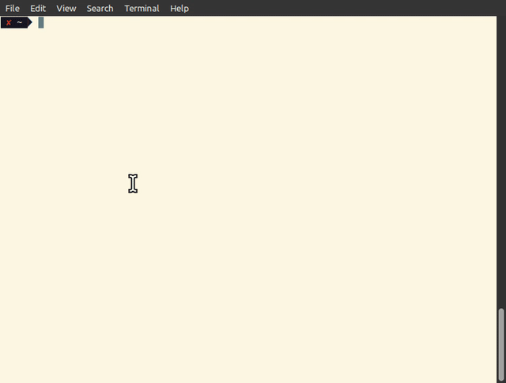
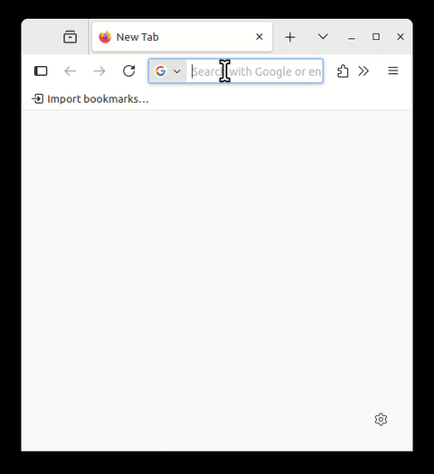

# pastebin

**pastebin** is a simple, local-network-only, HTTPS-based Pastebin-like Linux tool for quickly sharing text snippets between devices on your <u>**home LAN**</u>.

This project is designed to be minimal and secure-by-default, exposing content only over HTTPS.

---

## ✨ Features

- Share temporary text snippets via web browser
- HTTPS by default — no unencrypted HTTP
- Works only within your **local network**
- Interactive **built-in graphical IP selector**
- Automatically generates a **QR code** for mobile access
- No external dependencies or accounts

---

## 🚀 Quick Start

1. Clone and build the project:

   ```bash
   git clone https://github.com/vitorz/pastebin.git
   cd pastebin
   go build -o pastebin main.go
   ```

2. Run the server on the default port (8443):

   ```bash
   ./pastebin
   ```
   Or run it selecting a custom port with:
   ```bash
   ./pastebin -port <custom port>
   ```

3. At startup, you’ll be prompted to select a local IP address to bind to.  
   This is done using a **custom graphical selector** rendered in your terminal.

4. After selection, a page URL and a related **QR code** will be shown in the terminal pointing to an HTTPS protected page where you can submit text to share.


5. Open your browser on any LAN-connected device/machine and go to:

   ```
   https://<your-selected-ip>:8443
   ```

   *(Note: the certificate is self-signed; your browser may show a security warning.)*
   
   

---

## 📱 Mobile Convenience

For easier interaction from mobile devices (phones, tablets, etc.), a **terminal QR code** is displayed as soon as the server starts. Additionally, after storing a snippet through the web app, a QR code linking to the content is also shown directly on the web page.

This allows you to quickly access the pastebin interface by scanning — no manual typing required on mobile devices with camera.

---

## 🔐 Security

- HTTPS is always enforced (self-signed certificate will be generated if not present)
- Regarding the content view URLs: the sensitive information (a randomly generated 4-character content identifier) is stored in the fragment identifier (after the #) of the URL. This part remains client-side and is not included in HTTP GET requests to the server.
- No persistence: content lives only in memory
- No authentication or login
- Intended for **trusted, local network use only**

---

## 📝 License

This project is licensed under the [MIT License](LICENSE).

---

## ⚠️ Disclaimer

> This software is provided **"as is"**, without any express or implied warranties.  
> The authors are **not responsible** for any data loss, misuse, or security issues.  
> Use it **at your own risk**, only within trusted local environments.

---

## 🙌 Credits

Built in Go to solve a personal need — no cloud, no accounts, just clean LAN-based snippet sharing with privacy and simplicity in mind.
